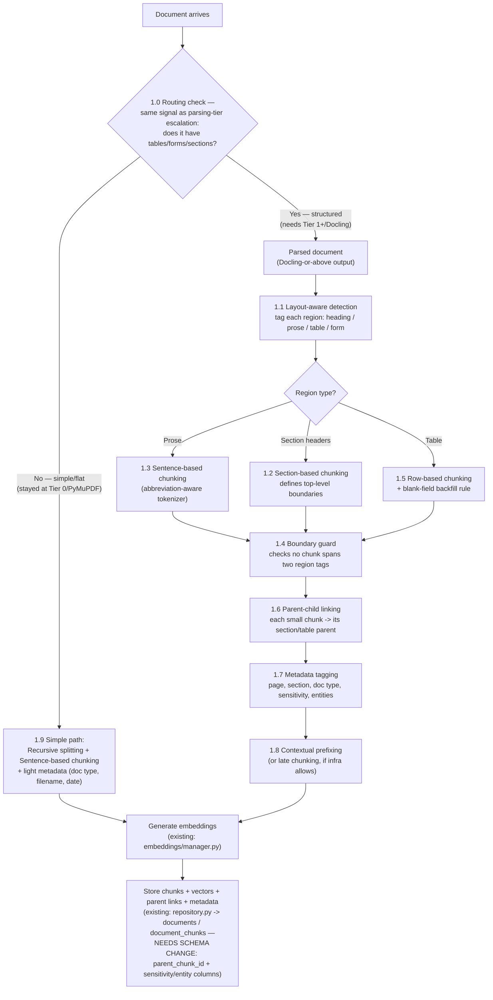
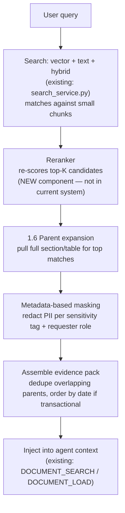

# Chunking Strategy — Decision, Flow, and Comparison

**Context:** Part of the Tada Studio data/context layer architecture assignment (see `context.md` Part 12/14, `project_vipul_data_layer_assignment` memory). This document covers the chunking sub-decision: which techniques to use, why, their requirements/failure modes, the actual step-by-step flow, and how this compares to what the existing codebase does today (see `existing-dataarchitecture.md`).

Evaluated against real banking document samples (a BofA credit card statement, an HSBC bank statement) and generalized to banking documents broadly — statements, KYC forms, loan/contract agreements, IDs, invoices.

---

## 1) What We Are Using, and Why

No single chunking technique is used alone. Documents are routed through a **decision tree**: first classify what kind of content a region is, then apply the technique suited to that region, then apply a common set of steps (boundary protection, hierarchy linking, metadata tagging) to everything regardless of which technique produced it.

### 1.0 Routing: which path does a document take? (added 2026-09-02)

There are two paths, and **the fork is decided by the same signal that already drives the parsing cascade's Tier 0 → Tier 1 escalation** (see `parsingstrategy.md` section 6, "chunking-driven trigger") — this is one decision made once per document, not a separate classifier built for chunking.

- **Structured path:** any document with tables, forms, or multiple distinct sections — i.e. nearly every banking document (statements, KYC forms, contracts, IDs). These require Docling-or-above parsing output and go through the full pipeline in 1.1–1.8 below.
- **Simple document path:** genuinely flat, unstructured documents — plain prose with no tables/forms/sections (e.g. a plain internal memo). These stay at Tier 0 (PyMuPDF) in the parsing cascade and don't need layout-aware chunking at all, because the problems it solves (table structure, column mixing, section boundaries) don't exist for them. See section 1.9 below.

**In practice, for Tada Studio's banking document mix, most documents take the structured path** — this is why the parsing-strategy update flagged that Tier 0 rarely finishes the job alone. The simple path still matters for the minority of genuinely flat documents the platform will also handle.

### 1.1 Layout-aware structural detection — the foundation (structured path only)

**What it is:** Uses a layout-aware parser (Docling or better — NOT raw PyMuPDF text) to classify each region of a page as heading, paragraph, table, or form block, and reconstruct tables as real row/column objects, not flattened text.

**Why chosen over the alternative (skipping straight to a text splitter):** Every other decision in this pipeline — section splitting, row splitting, boundary protection — needs to already know what kind of content it's looking at. Without this step, nothing downstream has real structure to work with; this was the root cause behind every early failure mode found (column-mixing, mid-row cuts, table/paragraph confusion).

**Requirements to use it:**
- Needs at least a Tier 1 (Docling) or Tier 2 (Azure Document Intelligence) parser output — see `parsingstrategy.md`. Not usable with Tier 0 (PyMuPDF) text alone, since Tier 0 has zero layout understanding.
- Needs the table-structure sub-model (e.g. Docling's TableFormer) to actually reconstruct tables as row/column objects.

**When it fails:**
- If the document only went through Tier 0 parsing (plain text extraction), this entire foundation is unavailable and everything downstream reverts to naive, unstructured behavior.
- On very poor-quality scans, even a layout-aware model can misclassify regions (e.g. mistake a form for a paragraph) — errors here propagate to everything built on top of it.

---

### 1.2 Document-structure / section-based chunking

**What it is:** Splits at detected section headings (e.g. "Account Summary" vs. "Payment Information", or numbered clauses in a contract), using the heading tags produced by 1.1.

**Why chosen over the alternatives:**
- *Not paragraph-based chunking:* paragraph-based splitting depends on the extractor preserving blank-line breaks at the right spots — unreliable on visually-boxed, multi-column bank layouts (no guaranteed blank lines).
- *Not fixed-size/sliding window:* both cut blindly through text with no idea where one section ends and another begins — this is exactly what caused unrelated fields (e.g. "Previous Balance" and "New Balance Total" from two different boxes) to end up mixed in the same chunk in early testing.

**Requirements to use it:** Depends entirely on 1.1 having correctly tagged headings first.

**When it fails:** If a document has no visually distinguishable heading styling (e.g. a poor scan where section titles use the same font/size as body text), section boundaries can't be detected — falls back to treating the whole page as one section.

---

### 1.3 Sentence-based chunking — scoped to prose regions only

**What it is:** Splits narrative/legal text (warnings, disclosures, contract clauses) at sentence boundaries, never mid-sentence. Only applied to regions 1.1 already tagged as "prose" — never applied to label:value fields or tables.

**Why chosen over the alternatives:**
- *Not semantic chunking:* semantic chunking could also work on prose, but requires an embedding call per sentence just to decide the boundary, and its topic-shift decisions aren't fully predictable/auditable. Plain sentence-boundary detection gets the same good outcome (e.g. keeping a late fee and its penalty APR in one chunk because they're one sentence) without that cost or unpredictability.
- *Not paragraph-based:* same reliability problem as in 1.2.
- *Not fixed-size/sliding window:* would cut mid-sentence, separating related facts (this was the very first failure mode demonstrated — the $38 late fee getting separated from the 29.99% penalty APR).

**Requirements to use it:**
- The region must already be classified as "prose" by 1.1 — sentence-based chunking is a no-op or unpredictable on label:value/table regions, which is exactly why it's scoped this narrowly.
- **Must use a real sentence tokenizer with a built-in abbreviation exception list** (e.g. NLTK's Punkt tokenizer, spaCy's sentence segmenter) — not a naive `period + space + capital letter` regex.

**When it fails:** Without the abbreviation-aware tokenizer, misfires on abbreviations common in bank documents — e.g. `"P.O. Box"` gets wrongly split at `"P."`, separating the mailing-address label from its box number.

---

### 1.4 Content-type boundary enforcement

**What it is:** A guard that runs after chunks are created (regardless of which technique made them) and checks: does any single chunk's text span two differently-tagged regions (e.g. part table, part prose)? If so, it splits the chunk back apart at the region-tag boundary.

**Why chosen:** Row-based or section-based chunking can occasionally overshoot (e.g. a table-row handler using an approximate size limit instead of the exact table edge) and pull in a neighboring unrelated sentence. This guard catches and fixes that without needing a separate chunking pass — concrete example: a table's last row getting glued to an unrelated footer sentence ("If you would like information about credit counseling services, call 866.300.5238.") got split back into two clean chunks once the guard checked region tags.

**Requirements to use it:** Needs the region tags from 1.1 as ground truth to check against.

**When it fails:** It can only enforce boundaries based on the tags it's given — if 1.1 misclassified a region in the first place, this guard inherits and can't independently correct that error.

---

### 1.5 Row-based / table chunking, with a blank-field backfill rule

**What it is:** For tables (transaction logs, fee schedules, repayment tables), chunk by row — one row/logical record = one chunk. Includes an explicit, deterministic rule: *if a row's field (e.g. date) is blank, copy the value from the nearest preceding row that has one* — this resolves the common bank-statement convention where a date is only printed once per day and left blank for that day's later transactions.

**Why chosen over the alternatives:**
- *Not treating the whole table as one chunk (paragraph-based):* only works while the table is short enough to fit in one chunk — breaks the moment a statement has enough transactions to exceed the size limit.
- *Not fixed-size/sliding window:* the very first failure mode found — cuts merchant names in half, separates amounts from their rows.
- *Not semantic chunking:* actively dangerous here — could regroup transactions by topical similarity (all bill payments together, all credits together) instead of preserving the date order a running balance depends on for reconciliation.
- *Not proposition-based or agentic chunking:* both could also resolve the blank-date problem, but by paying for an LLM call per document and introducing either a silent number-rewriting risk (propositions generate new text) or non-determinism that's hard to defend in an audit (agentic judgment calls). The backfill rule gets the identical correct result for a fraction of the cost, fully explainable in code — a bank auditor can be shown the exact rule, not "the model decided."

**Requirements to use it:**
- Needs 1.1's table-structure reconstruction (real row/column objects, not flattened text).
- Needs the backfill rule explicitly coded for the specific blank-field convention observed.

**When it fails:**
- If a different document/issuer uses a different continuation convention (e.g. ditto marks, or always repeating the date), the single "blank = inherit from above" rule won't generalize — needs per-format tuning or a more general convention-detector.
- If the table-structure model misreads the table shape (e.g. merged cells misidentified), the row extraction itself is wrong before the backfill rule even runs.

---

### 1.6 Hierarchical / parent-child retrieval

**What it is:** Small chunks (single rows/lines) are what's matched against a query, but once matched, the system pulls in the chunk's larger "parent" (the full section or table it belongs to) to give the LLM real context.

**Why chosen over the alternatives:**
- *Not using large chunks everywhere:* large chunks retrieve poorly — a query can match ambiguously across many unrelated fields packed into one block.
- *Not sentence-window (fixed neighbor count):* a fixed window size is a guess that can miss a longer same-day transaction group, or bleed into an unrelated adjacent section. Parent-child uses the document's *actual* structural boundary, so it's correct by construction, not by luck.

**Requirements to use it:**
- Needs an explicit parent-child link stored alongside each chunk — **this requires a schema change**: `document_chunks` (current table, per `existing-dataarchitecture.md`) doesn't have a parent/hierarchy reference field today.
- Needs a sensible parent-size decision made per content type (whole table vs. whole section vs. something narrower) — this needs tuning, not a universal default.

**When it fails:**
- Choosing too broad a parent (e.g. entire document) reintroduces the "too much irrelevant content" dilution problem.
- Adds token/cost overhead at query time — every matched query now pulls a full section/table into the LLM's context, not just the matched fragment; can add up at scale with many concurrent queries.

---

### 1.7 Metadata-enriched chunking — mandatory, not optional

**What it is:** Every chunk (regardless of which technique created it) gets tagged with page number, section, document type, sensitivity level, and extracted entities (account holder, account number, issuer, etc.).

**Why chosen:** Not really "chosen over an alternative" — there isn't a competing technique here. It's metadata vs. nothing. Without a sensitivity/entity tag per chunk, there is nothing for a masking or access-control rule to check at query time. Directly closes two gaps already flagged: PII/masking (original assignment scope) and authorization consistency (flagged as an observed gap in `existing-dataarchitecture.md`). It's also the raw material the ontology/knowledge-graph layer (added to scope per `context.md` Part 14) will need — entities and relationships have to come from somewhere, and this is where.

**Requirements to use it:**
- Most tags (page, section, doc type) are free — already known from step 1.1/1.2/1.5's output.
- Entity tags (account holder, account number) need either a structured field already present from parsing, or a lightweight named-entity-recognition pass — much cheaper than a full LLM call.
- Needs schema support: new metadata columns on `document_chunks`.

**When it fails:** If entities aren't cleanly extractable (e.g. messy OCR), tags can be incomplete or wrong — a masking policy relying on a missed tag could under-redact sensitive data; relying on a false-positive tag could over-redact. Tagging accuracy itself needs a safeguard, it isn't infallible.

---

### 1.8 Contextual prefixing + reranker — the late-chunking substitute

**What they are:**
- **Contextual prefixing:** before embedding, prepend a short context string built from 1.7's metadata to each chunk's text (e.g. `"BankAmericard statement, Account Summary, period ending 01/08/2018: Interest Charged $67.40"`), so a standard (short-context) embedding model still gets some document-level context baked into the embedding.
- **Reranker:** after initial vector/text/hybrid search, re-score the top candidates with a model that looks at the query and chunk together — catches cases the initial embedding search under-ranked.

**Why chosen over late chunking:** Late chunking (embedding the whole document first with a long-context model, then pooling per chunk) gives a similar benefit, but requires a specific long-context embedding model and has a document-length ceiling. If that infra isn't available/approved, contextual prefixing achieves a similar effect with any standard embedding model, and a reranker catches what prefixing alone doesn't — both together approximate late chunking's benefit without the infra dependency. **Note:** a reranker is already recommended in `existing-dataarchitecture.md`'s own redesign direction ("add a multi-stage retriever: candidate generation, reranking, evidence packing"), so this isn't a net-new ask — it's confirming the direction already flagged.

**Requirements to use it:** Reranker needs a cross-encoder model available at query time (lighter infra ask than a long-context embedding model, but still a new component not present today).

**When it fails:** If the contextual prefix is too long relative to the actual chunk content, it can dilute the embedding's focus — the prefix should stay short/summarized. Reranking adds latency per query — needs a reasonable candidate shortlist size (top-K), not reranking everything.

**If infra does support a long-context embedding model:** use **late chunking** directly instead of contextual prefixing (see section 3, "Conditional / Infra-Dependent").

---

### 1.9 Simple document path — no layout detection needed (added 2026-09-02)

**What it is:** For documents that took the "simple" fork in 1.0 (flat prose, no tables/forms/sections, stayed at Tier 0/PyMuPDF in the parsing cascade), skip 1.1–1.6 entirely and chunk using only:
- **Recursive character/text splitting** — promoted from "fallback only" (see section 2) to the *primary* technique for this path. Respects paragraph → sentence → word boundaries in order, without needing any structural tagging.
- **Sentence-based chunking** (1.3, with the same abbreviation-aware tokenizer requirement) — applies directly since the whole document is prose, not just a region within it.
- **Metadata tagging** (1.7) still applies, just lighter — document type, filename, upload date, rather than section/entity tags, since there's no table/form to extract those from.

**Why this is correct, not a shortcut:** all the heavier machinery in 1.1–1.6 (layout detection, row-based chunking, boundary guards, hierarchy linking) exists specifically to handle *structure* — telling a table apart from a paragraph, protecting rows, separating columns. A genuinely flat document has none of those problems, so applying that machinery would be unnecessary overhead solving problems that don't exist for this content.

**Requirements to use it:** None beyond Tier 0 (PyMuPDF) parsing output and a proper sentence tokenizer — this is the cheapest, lowest-dependency path in the whole design.

**When it fails / when to watch for misclassification:** If a document is wrongly classified as "simple" when it actually contains an embedded table or form the parsing-tier check missed, it will get chunked with no table protection at all — reviving the original mid-row/mid-cell failure modes from section 2. This makes the accuracy of the Tier 0/1 routing decision itself (shared with the parsing cascade) load-bearing for this path, not just a convenience classification.

---

## 2) What We Are NOT Using, and Why

| Strategy | Why rejected |
|---|---|
| **Fixed-size chunking** | Cuts blindly by character count — orphans numbers from their labels, cuts merchant names mid-word. Worst-case for any document where a number's meaning depends on an adjacent label — true of nearly every banking doc type. |
| **Sliding window chunking** | Brute-force redundancy instead of structural understanding — roughly doubles storage/embedding cost, and only *statistically* reduces (never eliminates) the orphaned-fact problem. Not justifiable at platform scale. |
| **Paragraph-based chunking (as a primary strategy)** | Entirely dependent on whether the extractor preserved blank-line breaks at the right visual dividers — unpredictable across different banks'/issuers' layouts, can't be trusted as the main rule. |
| **Semantic chunking (on structured/tabular content)** | Its core mechanism — grouping by topic similarity — actively works against the one property (strict sequential/chronological order) that gives a ledger or repayment schedule its meaning. Also unreliable/noisy on short label:value lines. Not needed for prose either, since sentence/section-based chunking already covers that adequately at lower cost. |
| **Proposition-based chunking** | The LLM *generates* new text rather than extracting it — a silently mis-transcribed number (e.g. a transposed digit) looks exactly as confident as a correct one, with no visual cue anything went wrong. Too dangerous for financial figures without a dedicated verification/cross-check layer, which nobody has built. |
| **Agentic / LLM-based chunking (as a primary strategy)** | Non-deterministic — the same document can chunk differently on a re-run. On already well-structured banking docs it mostly re-derives what the rule-based methods (1.1-1.5) already produce for free, at much higher cost. Given Mashreq's governance emphasis (Atlas/MRM/ISG), "the model judged this was coherent" is a materially weaker answer in an audit than a rule you can point to in code. |

**Used only as a fallback, never as a primary strategy:**
- **Recursive character/text splitting:** on the structured path, acceptable only as a last-resort splitter for an oversized text block that doesn't fit cleanly under any structural rule above — never the main strategy there. **Updated 2026-09-02:** on the simple document path (section 1.9), this is promoted to the *primary* technique, since a flat document has no structure for the heavier rules to key off in the first place.
- **Sentence-window chunking:** a lighter-weight substitute for hierarchical (1.6) parent-child retrieval when a full parent-child hierarchy hasn't been built yet — shares the same fixed-window fragility as sliding window, just at sentence/row granularity instead of character granularity.

---

## 3) Conditional / Infra-Dependent — RESOLVED (2026-09-03, see `embedding-strategy.md`)

**Late chunking** (embed the whole document first with a long-context model, then pool per chunk afterward): would have been adopted **directly in place of contextual prefixing + reranker (1.8)** if the platform's embedding model supported it. **This is now resolved: the working embedding decision is Azure OpenAI `text-embedding-3-large`, which returns a single pooled vector per input, not token-level embeddings — so late chunking is off the table.** Contextual prefixing + reranker (1.8) is now the actual plan for this gap, not a hedge. Full reasoning, including what would reopen this decision (a self-hosted fallback like Jina), is in `embedding-strategy.md`.

---

## 4) The Exact Flow — Step by Step

### Ingestion time (happens once per document)

**Worked example (BofA statement):**
1. Layout detection tags: *Account Summary → form block. Payment Information → form block. Late Payment Warning → prose. Minimum Payment table → table.*
2. Routing: Late Payment Warning → sentence chunking (`"...late fee of up to $38.00 and your APRs may be increased up to the Penalty APR of 29.99%."` stays whole). Account Summary/Payment Information → section chunking (each box becomes its own group, never mixed). Minimum Payment table → row chunking (`"$165.00 | 36 months | $5,940.00"` = one chunk).
3. Boundary guard checks: did any table-row chunk accidentally include the neighboring "credit counseling" footer sentence? If so, split it back apart.
4. Every chunk gets a parent link (e.g. the $165 row's parent = the whole Minimum Payment table + its intro sentence + column headers).
5. Every chunk gets tagged (section = "Account Summary", sensitivity = "financial", etc.).
6. A short context string is prepended before embedding: `"BankAmericard statement, Account Summary, period ending 01/08/2018: Interest Charged $67.40"`.
7. Embed and store, along with the parent link and tags.

### Retrieval time (happens per query)

**Worked example:** Query *"What's my interest charge this cycle?"* → search finds `"Interest Charged $67.40"` → reranker confirms it's the best match over close runner-ups → parent expansion pulls in the whole Account Summary section (so a follow-up about the new balance can also be answered) → masking check passes (not PII) → the full Account Summary section is handed to the LLM to answer from.

---

## 5) Comparison With the Existing System's Chunking (per `existing-dataarchitecture.md`)

| Aspect | Existing system today | What we're proposing |
|---|---|---|
| **Chunking approach** | "Loads content through loader factories, chunks via chunking strategies, and annotates chunk metadata" — described in the as-is review as **mostly parameter-driven chunking with no adaptive policy per content type** (explicitly flagged gap: "Chunk quality controls"). | Content-type routing first — prose, sections, and tables each get the technique suited to them, not one fixed rule applied blanket. |
| **Table handling** | No dedicated table/row awareness mentioned; flagged generally under "chunks are mostly text slices." | Row-based chunking with an explicit backfill rule for blank/inherited fields (e.g. dates). |
| **Chunk metadata** | Lightweight already: page/source/chunk index (per `documents.storage_path`/`document_chunks` usage). | Adds sensitivity level and extracted entities (account holder, account number, etc.) — needed for PII masking and the ontology/knowledge-graph layer, neither of which the metadata today supports. |
| **Hierarchy / context on retrieval** | Not present — chunks are retrieved as flat, independent units via vector/text/hybrid search. | Adds parent-child linking so a matched chunk brings its full section/table along for context — requires a schema addition (`parent_chunk_id` or equivalent) that doesn't exist in `document_chunks` today. |
| **Reranking / grounding** | Explicitly flagged as missing: "no dedicated reranker/citation confidence layer beyond base vector/text/hybrid ordering" → "higher hallucination risk under ambiguous queries." | Adds a reranker between initial search and answer assembly — this proposal is a direct implementation of that already-identified gap, not a new idea competing with it. |
| **Retrieval search modes (vector/text/hybrid)** | Already implemented and working (`search_service.py`, PostgreSQL `tsvector`/`tsquery`, reciprocal-rank-fusion). | **Kept as-is and built upon** — this proposal doesn't replace the existing search layer, it adds better-prepared chunks (context-prefixed, hierarchically linked, tagged) and a reranking step on top of it. |
| **Ontology/knowledge graph** | Not present — flagged as "no ontology graph or canonical entity/relation layer" under "Knowledge modeling" gap. | Not solved by chunking alone, but metadata-enriched chunking (1.7) produces the entity/relationship groundwork that layer will need — see `context.md` Part 14 for the expanded ontology/knowledge-graph scope. |

**Bottom line:** the existing system's chunking is a single, uniform, parameter-driven pass — exactly the gap its own architecture review flagged. What's proposed here doesn't replace the existing retrieval infrastructure (search modes, embedding pipeline) — it replaces the *chunking step specifically* with content-type-aware routing, adds the missing reranker the existing gap analysis already called for, and adds the metadata/hierarchy groundwork the ontology layer and PII-masking requirements depend on.
