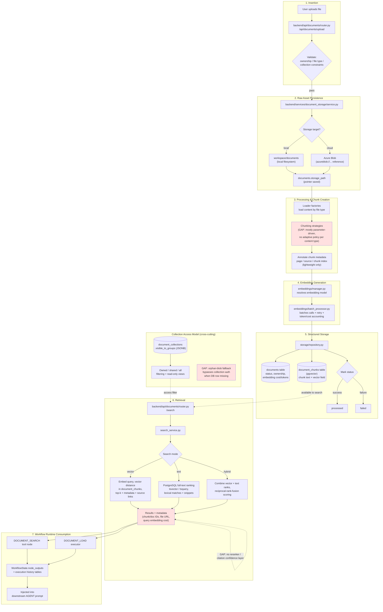

# Data Lifecycle & Context Layer — Existing (As-Is) Architecture

**Source:** Screenshots of an architecture-analysis document (Step 15 of 16) generated from the actual current Tada Studio codebase — transcribed here verbatim/faithfully from the images, not from theory or assumption.

**What this page covers:** the data and knowledge hub lifecycle — insertion, storage, retrieval, runtime usage — and governance gaps, as a basis for the context-layer redesign work.

---

## 1) End-to-End Lifecycle (Current State in Code)

**Lifecycle diagram: Ingestion to Runtime Context**

```
Upload file → Create document row → Parse + chunk → Generate embeddings → Store chunks + vectors →
Search (vector / text / hybrid) → Inject into agent context
```

1. **Insertion: upload API receives files**
   Route `backend/api/documents/router.py` (`/api/documents/upload`) validates ownership, file type, and collection constraints.

2. **Raw asset persistence**
   `backend/services/document_storage/service.py` persists originals either to local storage (`workspace/documents`) or Azure Blob (`azureblob://...` references).

3. **Processing and chunk creation**
   The same service loads content through loader factories, chunks via chunking strategies, and annotates chunk metadata (page/source/chunk index).

4. **Embedding generation**
   `backend/services/document_storage/embeddings/manager.py` resolves the embedding model; `backend/services/document_storage/embeddings/batch_processor.py` batches embedding calls with retry and token/cost accounting.

5. **Structured storage**
   `backend/services/document_storage/storage/repository.py` writes into `documents` and `document_chunks` (with vector field), then marks status processed/failed.

6. **Retrieval API and search modes**
   `backend/api/documents/router.py` `/search` calls `backend/services/document_storage/search_service.py` for similarity, text, or hybrid retrieval across selected collections.

7. **Workflow runtime context consumption**
   `DOCUMENT_SEARCH` tool nodes and `DOCUMENT_LOAD` executor consume retrieved chunks/full content and inject outputs into workflow state for downstream `AGENT` prompts.

---

## 1a) Granular Flow Diagram (added 2026-09-02)

A more detailed view of the same seven-stage lifecycle above, showing the actual data domains it touches and exactly where the three gaps below bite in the live flow (not just as an abstract list).



**The three red points are where the Section 4 gaps live in the actual flow, not just as an abstract list:**
- **Chunking step (Stage 3):** parameter-driven, no content-type awareness — this is precisely what `chunking-strategy.md` is designed to replace.
- **Access model:** the orphan-blob fallback that skips authorization entirely when a document's DB row is missing — a live governance risk, not a future one.
- **Retrieval output:** no reranker/citation-confidence layer sits between search results and what gets used downstream.

Everything else in this diagram — upload validation, blob/local persistence, embedding batching with retry/cost tracking, the three search modes, workflow injection — is working infrastructure the redesign builds on top of, not replaces.

---

## 2) Data Domains in the Knowledge Hub

| Domain | Current Storage | Usage | Main Files |
|---|---|---|---|
| Raw document files | Azure Blob or local filesystem path in `documents.storage_path` | Download/view, reprocessing source | `backend/services/document_storage/service.py` |
| Document metadata | `documents` table | Status, ownership, embedding cost/tokens, listing/filtering | `backend/services/document_storage/storage/repository.py` |
| Knowledge chunks + vectors | `document_chunks` table (pgvector) | Semantic and hybrid retrieval | `backend/services/document_storage/search_service.py` |
| Collection-level access model | `document_collections.visible_to_groups` (JSONB) | Owned/shared/all filtering and read-only views | `backend/services/document_storage/collections/repository.py` |
| Execution context output | `WorkflowState.node_outputs` + execution history tables | Prompt context chaining, run replay, observability | `backend/services/nodes/executors/document_load.py` |

---

## 3) Retrieval Behavior in Practice

**Vector search:** Embeds user query, computes vector distance in `document_chunks`, returns top-k chunks with metadata and source links.

**Text search:** Uses PostgreSQL full-text ranking (`tsvector`/`tsquery`) over chunk content for lexical matches and snippets.

**Hybrid search:** Combines vector and text result ranks with reciprocal-rank-fusion style scoring for better recall/precision balance.

**Metadata capture:** Search metadata includes chunk/document identifiers, file URL/source location, and query embedding cost metrics.

---

## 4) Current Gaps in the Context Layer

| Gap Area | Observed Gap | Impact |
|---|---|---|
| Knowledge modeling | Chunks are mostly text slices with lightweight metadata, no ontology graph or canonical entity/relation layer. | Weak reasoning over relationships, limited explainability and lineage. |
| Cross-collection intelligence | Search is collection-scoped and query-time fused, without a global knowledge index strategy. | Lower recall for enterprise knowledge spread across domains. |
| Authorization consistency | Collection access checks exist, but orphan-blob fallback paths explicitly bypass collection authorization when the DB row is missing. | Potential governance risk and audit complexity for detached artifacts. |
| Chunk quality controls | No adaptive chunking policy per content type/domain confidence; mostly parameter-driven chunking. | Context fragmentation and variable retrieval quality. |
| Grounding and reranking | No dedicated reranker/citation confidence layer beyond base vector/text/hybrid ordering. | Higher hallucination risk under ambiguous queries. |
| Lifecycle versioning | Document reprocessing exists, but no first-class semantic versioning for chunks and ontology evolutions. | Difficult comparison, rollback, and impact analysis after re-indexing. |

**Note — direct link to the ongoing chunking-strategy work:** the "Chunk quality controls" gap ("no adaptive chunking policy per content type/domain confidence; mostly parameter-driven chunking") is exactly the problem the current chunking-strategy evaluation (see this session's Strategy 1-16 walkthrough on bank statement samples) is meant to address — the existing system doesn't pick a chunking approach based on what kind of document/content it's looking at, it just applies fixed parameters regardless of content type.

---

## 5) Redesign Direction for Knowledge Hub 2.0

**Redesign flow diagram:**

```
Raw assets → Normalization + enrichment → Ontology mapping → Hybrid indexes (vector + lexical + graph) →
Policy-aware retrieval → Grounded answer package
```

**Ontology layer:** Introduce entity, relation, and concept taxonomies so retrieval can answer not only "what text matches" but also "what relationships are relevant." *(Direct match to Vishal's ontology/knowledge-graph expansion of the assignment — see context.md Part 14.)*

**Knowledge RAG:** Add a multi-stage retriever: candidate generation, reranking, evidence packing, and citation confidence scoring before LLM generation.

**Governance-by-design:** Unify data access checks across document, chunk, and blob paths. Enforce deny-by-default with complete access audit events.

**Re-index lifecycle:** Version embeddings/chunks per strategy and model, track drift metrics, and enable rollback to known-good retrieval snapshots.

---

## 6) Practical Roadmap Starter

1. Stabilize current ingestion and authorization boundaries; remove unmanaged orphan access paths.
2. Add retrieval evaluation harness: precision@k, recall@k, groundedness, citation quality, latency and cost.
3. Introduce ontology extraction pipeline and persist entity-relation graph alongside chunk vectors.
4. Add reranker and evidence-pack builder between retrieval and AGENT prompt assembly.
5. Roll out collection-to-workspace governance model and policy-aware query planner for enterprise scale.

**What this unlocks:** A stronger context layer turns Tada from "workflow automation with document lookup" into a governed enterprise knowledge system where answers are grounded, explainable, and policy-compliant by default.
