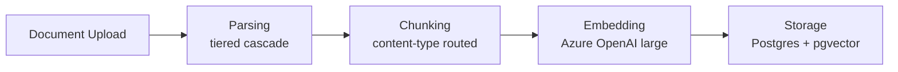
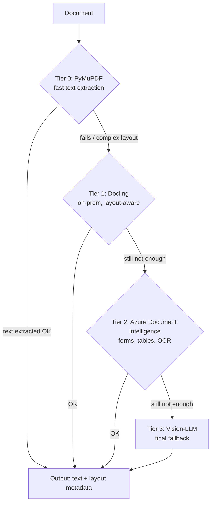
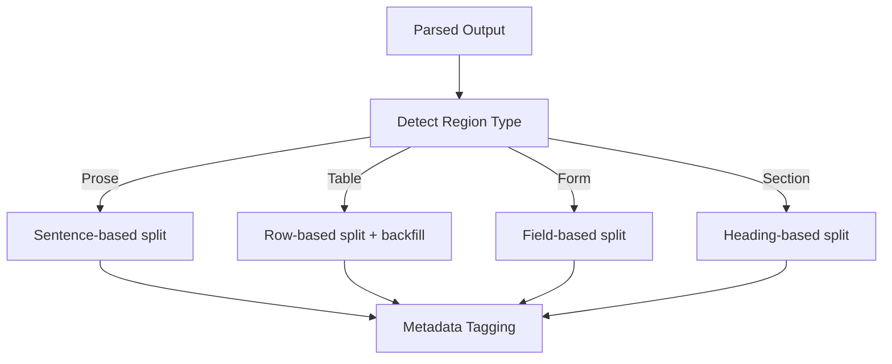
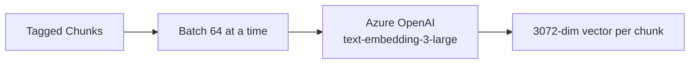
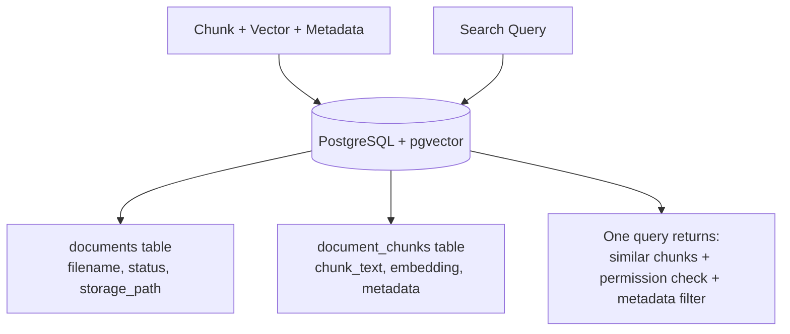

# Ingestion Pipeline — Proposed Strategy (Parsing, Chunking, Embedding, Storage)

**Scope:** This covers everything from document upload up to searchable storage.

---

## Overall Flow



---

## 1. Parsing

**Proposed strategy:** A 4-tier escalation cascade — start with the cheapest tool, escalate only when needed.



**What each tier does (one line each):**
- **Tier 0 — PyMuPDF:** Pulls raw text out fast and cheap; handles simple, clean documents.
- **Tier 1 — Docling:** Runs on our own servers; detects layout — tables, sections, headings.
- **Tier 2 — Azure Document Intelligence:** Cloud API; handles scanned forms and complex tables PyMuPDF/Docling can't.
- **Tier 3 — Vision-LLM:** Last resort; reads the document visually for the hardest cases (multi-column, heavily scanned).

**Chosen over:** Using one single tool (e.g., always Azure DI) for every document.

**Why:** Most documents are simple and don't need expensive processing — a fixed heavy tool would overpay on cost/latency for the majority of cases. Escalation only pays for what's actually needed, per document.

### Escalation Criteria (Three Options Under Evaluation)

We're testing three approaches to decide WHEN to escalate from one tier to the next. Final choice will be based on empirical testing against real banking documents.

**Option A: Quality/Output-Based**
```
Run PyMuPDF → Measure extracted text quality
  If: text_length < threshold (e.g., <100 chars) → escalate (extraction failed)
  If: garbled_chars > 10% → escalate (encoding/OCR issue)
  If: confidence_score < threshold → escalate (low confidence)
```
**Pros:** Grounded in actual results, clear signal. **Cons:** Only catches failures AFTER parsing (wasted PyMuPDF call). Needs test docs to set thresholds.

**Option B: Structure/Layout-Based**
```
Analyze document structure BEFORE parsing
  If: contains tables → escalate to Docling (preserve table structure)
  If: contains forms → escalate to Docling (preserve field labels)
  If: detected_scanned → escalate to Azure DI (needs OCR)
```
**Pros:** Avoids wasted PyMuPDF calls, targets right tool to doc type. **Cons:** Requires upfront layout detection. Needs test docs to validate detection accuracy.

**Option C: File Characteristics-Based**
```
Check file properties BEFORE parsing
  If: file_size > 5MB → start at Docling (probably complex)
  If: image_ratio > 50% → start at Vision-LLM (mostly images)
  Else: start at PyMuPDF (probably simple)
```
**Pros:** Fastest, no parsing overhead, uses metadata only. **Cons:** Crude heuristic, may miss edge cases. Needs test docs to validate accuracy.

**Next Step:** Will empirically test all three approaches against real banking documents and finalize based on which works best for our document mix.

---

## 2. Chunking

**Proposed strategy:** Detect content type first, then route each type to its own natural chunking method — not one generic rule for the whole document.



**What each strategy does (one line each):**
- **Sentence-based (prose):** Splits at sentence boundaries, abbreviation-aware, so paragraphs stay coherent.
- **Row-based (tables):** Splits by row; if a date/ID is blank because it was only printed once, it gets automatically backfilled so each row chunk stays complete on its own.
- **Field-based (forms):** Keeps label and value together (e.g., "Name: John " stays one chunk).
- **Heading-based (sections):** Splits at major headings, preserving document outline/hierarchy.
- **Metadata tagging (applies to all types):** Every chunk gets tagged with region type, section path, sensitivity level, entity tags, and a parent-chunk link — used later for filtering and context assembly.

**Chosen over:** Fixed character-count chunking 

**Why:** Character-based splitting breaks tables mid-row and mixes unrelated content into one chunk. Routing by content type preserves the actual structure of the document, which directly improves what gets retrieved later.

---

## 3. Embedding

**Proposed strategy:** Azure OpenAI `text-embedding-3-large`, run in-tenant.



**Explanation:** Converts each chunk's text into a list of numbers representing its meaning, so search can match by meaning, not just exact words.

**Chosen over:** Cohere (multilingual), Voyage AI (new vendor, no clear benefit), and self-hosted open-source models (BGE/Jina/E5 — would need our own GPU infrastructure).

**Why:** Reuses the same in-tenant Azure approval already needed for the Vision-LLM tier — one governance conversation instead of two. Chose the larger model over the cheaper "small" version because retrieval accuracy matters more here (banking data) than the small cost difference, and because vectors from different models can never be mixed later — the choice is effectively permanent once made.

---

## 4. Storage

**Proposed strategy:** PostgreSQL with the `pgvector` extension — not a separate vector database.



**One-line explanation:** Stores chunks, their vectors, and their metadata together in one database, so a single query can search by meaning, filter by sensitivity, and check permissions all at once.

**Chosen over:** A dedicated vector database (e.g., Azure AI Search) as a separate system.

**Why:** A separate vector database would mean duplicating chunk data outside Postgres, and splitting permission checks across two systems instead of one query. Postgres does both together — it's the only option that avoids that split.

---

## Summary Table

| Stage | Proposed | Chosen Over | Core Reason |
|---|---|---|---|
| Parsing | 4-tier escalation cascade | One fixed tool for all docs | Avoid overpaying on simple documents |
| Chunking | Content-type routing | Fixed character-count splitting | Preserves table/form/section structure |
| Embedding | Azure OpenAI large, in-tenant | Cohere, Voyage, self-hosted | Reuses existing approval, model choice is permanent so chose accuracy |
| Storage | Postgres + pgvector | Separate vector database | One query for search + permissions + filtering |
