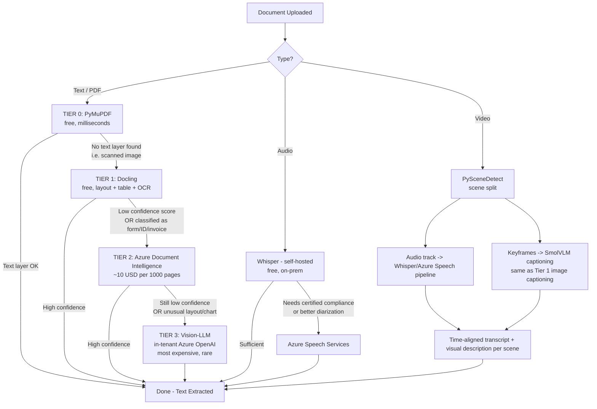

# Document Parsing Strategy — Tada Studio Data Layer

**Date discussed:** 2026-08-31
**Author:** Vipul
**Context:** Part of the data/context layer architecture assignment from Vishal (see `project_vipul_data_layer_assignment` memory / context.md). This document covers specifically the document-parsing sub-problem — how raw uploaded files (PDFs, forms, scans, IDs, contracts, audio, video) get turned into text/structured data before chunking, embedding, and retrieval.

---

## 1. The Problem

Tada Studio's Document Search node needs to read every kind of document a bank might receive — clean PDFs, scanned KYC forms, IDs, contracts, handwritten notes — and turn them into text an AI agent can reliably use.

No single parsing tool handles all of this well:

- **Cheap/free tools** are fast but fail on complex forms, handwriting, and scanned pages.
- **Expensive/specialized tools** handle those hard cases well, but cost money per page and add latency.
- **The most capable tool available** (a Vision-LLM reading a page like an image) is the most flexible, but is slow, costly, and has a known failure mode — it can **silently drop rows from a table** without any warning that it did so.

Picking just one tool forces a bad trade-off: underperform on the hard documents that matter most (forms, IDs — exactly what a bank deals with), or overpay/over-wait on the easy ones that make up most of the volume.

---

## 2. Options We Considered and Rejected

| Option | Why it looked appealing | Why we rejected it |
|---|---|---|
| **Docling only** (single free tool) | Zero marginal cost, self-hosted, keeps data in-network — attractive for a bank | Documented accuracy issues on complex tables, structured forms, and handwriting — exactly the KYC/ID/contract documents that matter most for compliance. Using it alone would silently under-serve our highest-stakes document types. |
| **Azure Document Intelligence only** (single paid tool) | Purpose-built, Microsoft-trained models for forms/IDs/invoices — highest accuracy on the hard cases | We'd pay per page for *every* document, including the 80–90% that are simple/clean and don't need it. Wasteful at platform scale (thousands of documents), and doesn't remove latency for the easy majority. |
| **Vision-LLM only** (send every page to a multimodal model) | Most flexible — reads a page almost like a human, preserves visual/spatial relationships (charts, merged cells) | Slowest and most expensive option by far. Has a documented, serious flaw: it can **silently omit table rows or fields** without indicating it did so — unacceptable as a default for financial data unless paired with something to catch it. Not viable as the primary path. |
| **Fixed rule: route by file type only** (e.g. "PDF → Docling, image → Azure DI") | Simple to implement, no confidence scoring needed | Too coarse — a "PDF" can be a clean digital contract or a scanned, skewed form; file type alone doesn't predict difficulty. Would either over-route (unnecessary cost) or under-route (accuracy loss) constantly. |

**Common thread in all four rejections:** each locks in one tool's specific weakness as the platform's permanent weakness. Given Tada Studio must handle *any* document type across the bank, no single fixed choice was acceptable.

---

## 3. How We Reached the Conclusion

The reasoning that got us to the final approach:

1. **Observation:** most real-world documents are actually easy to parse (clean PDFs, simple text) — only a minority are genuinely hard (scans, forms, handwriting, unusual layouts).
2. **Implication:** if most documents are easy, paying full price (in cost or latency) on every document is wasteful. We only need the expensive/slow tools for the hard minority.
3. **Precedent:** this "cheap-first, escalate-on-difficulty" pattern is not new — it's the same principle behind the Viola-Jones face-detection cascade (early real-time computer vision) and modern LLM-routing systems. Documented production results: **45–85% cost reduction while retaining ~95% of quality**, because escalation is targeted, not blanket.
4. **Analogy that clarified the design for the team:** a support call center — a bot answers first (free, instant), escalates to a junior agent if needed, then a specialist, then a senior expert only for the rare hard case. Most calls resolve cheaply; only the genuinely difficult ones reach the expensive tier.
5. **Conclusion:** build a **confidence-gated cascade** — a chain of tools ordered cheapest/fastest to most expensive/slowest, where a document only advances to the next tool if the current tool can't confidently handle it.

This became our final decision: **a 4-tier cascade for text/PDF, plus two related but separate pipelines for audio and video.**

---

## 4. Final Flow (Diagram)



**Text-only ASCII version (for non-mermaid viewers):**

```
                    Document arrives (any type)
                              |
        +---------------------+---------------------+
        |                     |                     |
   TEXT/PDF                AUDIO                 VIDEO

TIER 0: PyMuPDF (free, ms)             Whisper (self-hosted, default)   PySceneDetect
   | escalate if: no text layer            | escalate if: needs             (scene split)
   v  (scanned)                            |  certified compliance /            |
TIER 1: Docling (free)                     |  better diarization          +-----+-----+
   | escalate if: low confidence,          v                              |           |
   |  OR classified as form/ID/invoice  Azure Speech Services          Audio      Keyframes
   v                                                                    track      (SmolVLM
TIER 2: Azure Document Intelligence                                   (Whisper/     caption)
   (~$10 / 1,000 pages)                                              Azure Speech)     |
   | escalate if: still low confidence,                                   |           |
   |  OR genuinely unusual page                                           +-----+-----+
   v                                                                            |
TIER 3: Vision-LLM (in-tenant Azure OpenAI)                          Time-aligned transcript
   (most expensive, used rarely, no                                  + visual description
    further escalation possible)                                          per scene
```

---

## 5. The Four Tiers (Text/PDF) — What and Why

- **Tier 0 — PyMuPDF:** Reads the PDF's internal text objects directly (not OCR) — near-zero cost, instant. Works great on clean, machine-generated PDFs. Zero understanding of layout, tables, or scanned content — used only as a first, fast filter. **Important dependency (added 2026-09-02, see section 6):** downstream chunking quality (see `chunking-strategy.md`) requires layout/table structure that only Docling-or-above can produce — so for any document type with tables, forms, or distinct sections, Tier 0 alone is insufficient even when it successfully extracts the text. In practice, for Tada Studio's banking document mix, most documents will escalate past Tier 0 for this reason, not just for parsing-difficulty reasons.
- **Tier 1 — Docling:** Open-source (MIT licensed, originally IBM Research Zurich, now under the Linux Foundation AI & Data Foundation). Runs layout analysis + a dedicated table-structure model (TableFormer). Does OCR for scans (EasyOCR/Tesseract/RapidOCR) and can caption embedded images using a small, self-hostable vision model (SmolVLM-256M-Instruct) — keeps image understanding on our own infrastructure. Weakness: general-purpose, not fine-tuned on bank-specific structured forms — documented accuracy issues on complex tables, forms, handwriting at scale.
- **Tier 2 — Azure Document Intelligence (Prebuilt):** Microsoft's managed service with models fine-tuned specifically for invoices, receipts, IDs, tax forms, contracts — exactly the specialization Docling lacks. Has a disconnected/container deployment mode for on-prem use, relevant to our data-residency requirements. Roughly $10 per 1,000 pages at public list price (actual Mashreq negotiated rate not yet confirmed).
- **Tier 3 — Vision-LLM (in-tenant):** Renders a page as an image, sent to a multimodal model (GPT-4o or Claude) via **in-tenant Azure OpenAI** — never the public API, keeping data in-network. Preserves visual relationships (chart shapes, merged table cells) other methods lose. Known limitation: can silently omit table rows/elements — output on numeric/tabular data should be treated as needing verification, not blindly trusted. Last resort given cost, latency, and this reliability caveat.

---

## 6. How Escalation Actually Works — Three Approaches Under Evaluation

**Status (2026-09-07):** We are testing three different escalation-decision mechanisms against real banking documents. Final choice will be based on empirical validation; all three are viable in principle.

### Approach A: Quality/Output-Based Escalation

**Decision logic:** Run the current tier, measure output quality, escalate if quality is poor.

- **PyMuPDF → Docling:** Check extracted text: if length < 100 chars, garbled_char_ratio > 10%, or confidence_score < 0.7 → escalate.
- **Docling → Azure DI:** Docling's Python library exposes genuine confidence score (0.0–1.0) plus quality grade (poor/fair/good/excellent). Escalate below threshold.
- **Azure DI → Vision-LLM:** Azure DI natively returns confidence scores per word, per field, per table cell — escalate if field-level confidence < threshold.

**Pros:** Grounded in actual results, clear signal, only escalates when necessary.

**Cons:** Wastes one parsing call per failed document. Thresholds need calibration from test data. Requires quality metrics to be implemented.

### Approach B: Structure/Layout-Based Escalation

**Decision logic:** Detect document structure/content-type BEFORE parsing. Route to tier that best handles that structure.

- **PyMuPDF → Docling:** If document contains tables, forms, or multi-column layout → escalate (Docling preserves structure; PyMuPDF flattens it). This is a *content-type* check, not a parsing-quality check.
- **Docling → Azure DI:** If pre-identified as form/ID/invoice type, skip to Tier 2 rather than wait for Docling to underperform on specialized structures.
- **Azure DI → Vision-LLM:** If output still contains low-confidence fields, or layout is genuinely unusual → escalate.

**Pros:** Avoids wasted parsing calls. Targets right tool to document type. Prevents known failure modes (e.g., PyMuPDF on tables).

**Cons:** Requires upfront layout detection logic. Needs test data to validate detection accuracy.

**Note (2026-09-02 finding):** For Tada Studio's banking document mix (statements, KYC forms, contracts, IDs — nearly all structured), this trigger fires on most documents, meaning Tier 0 rarely finishes alone in practice. **Cost/latency caveat:** this gives up some of the cascade's original savings promise. PyMuPDF's practical role narrows to a fast first check (does a text layer exist — useful for detecting scans cheaply) rather than a tier that regularly finishes processing.

### Approach C: File Characteristics-Based Escalation

**Decision logic:** Check file metadata BEFORE parsing. Use heuristics to predict complexity.

- **PyMuPDF → Docling:** If file_size > 5MB → escalate (large files often contain complex layouts, tables).
- **Docling → Azure DI:** If image_ratio > 50% → escalate (mostly images, likely scanned or highly visual).
- **Any tier → next:** If embedded fonts detected as missing/substituted → escalate (likely corrupted/complex structure).

**Pros:** Fastest approach (no parsing needed). Zero wasted parsing calls. Uses only metadata.

**Cons:** Crude heuristics (file size ≠ complexity). May escalate unnecessarily. May miss complex small documents.

### Next Step

Empirical testing (2026-09-07 onward): Will test all three approaches against real banking documents and finalize based on which works best for Tada's actual document mix.

---

### Backup: Tier-Specific Escalation Details (for reference)

If not using one of the three unified approaches above:

- **Docling deployment mode caveat:** Docling's confidence score is only available calling the Python library directly — not exposed if run as `docling-serve` isolated pod. This affects whether Approach A is feasible.
- **Which documents genuinely stay at Tier 0:** only truly flat, unstructured documents — plain prose with no tables, forms, or distinct sections (e.g. a simple internal memo). These use the lightweight chunking path in `chunking-strategy.md`. The same signal that decides parsing-tier escalation decides chunking-path routing — one decision made once per document, not two separate classifications.
- **Vision-LLM (Tier 3, no further escalation):** No reliable native confidence. Options: ask model to self-report confidence (weak), run twice and compare (expensive but acceptable since rare), or structurally validate output (most reliable but requires custom engineering).

---

## 7. Audio and Video (Related but Separate Pipelines)

- **Audio:** Self-hosted **Whisper** by default (free, full data control, on-prem), escalating to **Azure Speech Services** when certified compliance or better call-diarization (who-said-what) is needed — Azure Speech is the documented standard default for regulated industries like banking.
- **Video:** Splits into three parallel tracks rather than one fused pipeline: audio track goes through the same speech pipeline above; visual side uses scene detection (**PySceneDetect**) to pull keyframes, captioned using the same vision-captioning approach as Tier 1's Docling images (SmolVLM); the two are combined as **time-aligned chunks** (transcript + visual description per scene) rather than a single fused representation, to keep debugging and compliance review simpler.

---

## 8. Why the Cascade Beats Any Single Tool (Recap)

| If we only picked... | Problem |
|---|---|
| **Docling alone** | Free, but genuinely weak on forms/IDs/handwriting — exactly the documents that matter most for a bank |
| **Azure DI alone** | Accurate everywhere, but we'd pay per-page on every document, including the easy 80–90% that didn't need it |
| **Vision-LLM alone** | Best quality on paper, but slowest, most expensive, and can silently drop information without warning |

**With the cascade:** most documents resolve for free at Tiers 0–1; only genuinely hard cases cost money at Tier 2; only truly impossible pages need the rare, expensive Tier 3 fallback. No single tool's weak spot becomes the platform's weak spot.

---

## 9. Open Decisions — Not Yet Settled

These require information or a decision outside of research, not more investigation:

1. **Docling deployment mode:** Python library in-process (keeps the confidence score, but couples it tightly into our app) vs. `docling-serve` as an isolated pod (matches the "separate worker nodes" infrastructure direction, but loses the confidence signal today) — a real architecture trade-off to decide with Vishal/Sachin.
2. **Vision-LLM tenancy:** Need to confirm in-tenant Azure OpenAI is actually set up and approved for this project before assuming Tier 3 is buildable at all.
3. **Real Azure DI pricing:** Public list price is ~$10/1,000 pages, but Mashreq likely has a negotiated Enterprise Agreement rate — need the actual number from whoever owns the Azure cost center.
4. **Audio/video priority:** Needed in Phase 1, or can it wait? Depends on a confirmed near-term use case (call recordings? training videos?) — a roadmap/business call, not engineering.
5. **Escalation thresholds:** The actual confidence-score cutoffs (e.g., "escalate below 80%") can't be guessed — need tuning against real Mashreq documents once testing with actual data.

---

## 10. One-Line Summary

> Instead of betting everything on one parsing tool, we route documents through a cascade — free, fast tools handle the easy majority, and only genuinely hard cases (forms, IDs, scans, unusual layouts) escalate to paid, specialized tools. Best accuracy, lowest cost, full document-type coverage, without any single tool's weakness becoming the platform's weakness — and it's a proven pattern, not something invented from scratch.
